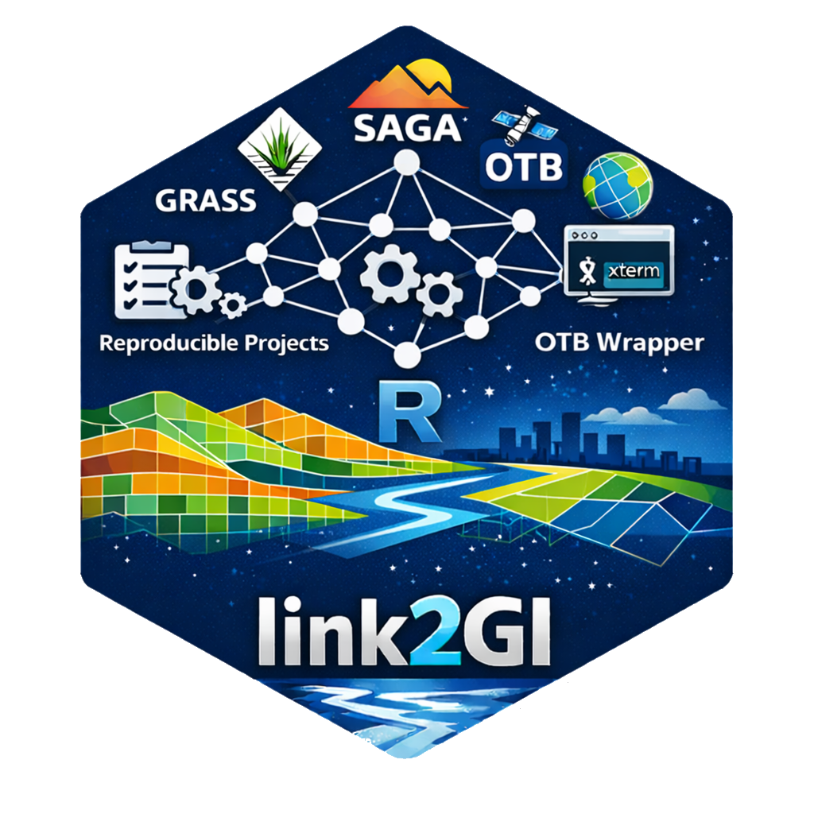

# `link2GI`

## Linking Geographic Information Systems, Remote Sensing and Other Command Line Tools 

[](https://cran.r-project.org/web/checks/check_results_link2GI.html)
[](https://cran.r-project.org/package=link2GI)
[](https://github.com/r-spatial/link2GI)
[](https://www.gnu.org/licenses/gpl-3.0.html)

Package website: [release](https://r-spatial.github.io/link2GI/)

`link2GI` provide some functions which make it a bit easier to connect
straightforward the common open source GI software packages to the
R-biotop. It supports both the use of wrapper packages and the direct
API-use via system calls. It focuses on `Linux` and `WindowsX` operating
systems but nevertheless it should also work with `OSX`.

If you have several versions installed or if you want to use the full
power of the GI software it will be a nice and helpful tool to deal with
some strange behaviours and requirements. Especially helpful is the
support of `OTB`, the `GDAL-Python` functions and a simple support to
use any `SAGA` version via the CLI. Hopefully `RSAGA` and `Rsagacmd`
will join forces in one package in the future. Anyway the current
releases of `RSAGA` as well as `Rsagacmd` will work with the environment
settings as provided by `linkSAGA`.

## Installation

`link2GI`is up to CRAN, please use `install.packages("link2GI")`.

However it is strongly recommended to install the latest stable
development version:

``` r
# devtools package
devtools::install_github("r-spatial/link2GI", ref = "master")
# remotes package
remotes::install_github("r-spatial/link2GI",ref = "master")
```

## Third Party software

To utilize the power of the open source GI tools from within `R` you
need to install them first. As a first promising opportunity to do
fulfill most of the requirements you may install `QGIS, GRASS`,
`SAGA-GIS` and `Orfeo-toolbox`. For further Information have a look at
the [Installation guide for link2GI related
Software](https://r-spatial.github.io/link2GI/articles/link2GI6.html).

## New Features

### GDAL CLI wrapper

`link2GI` now provides a minimal `GDAL` CLI wrapper for cases where
system-linked `GDAL` binaries must be used deterministically,
independent of what is compiled into packages like `sf` or `terra`. This
is not a replacement for existing GDAL-based R tools, but a
reproducibility-oriented layer that exposes the exact `GDAL` pipeline
used on a given system, with explicit environment control, lightweight
fingerprinting, help-driven skeletons, and optional NDJSON logging.

### OTB wrapper

The OTB integration in `link2GI` has evolved from a basic command
wrapper into a robust, Self-describing CLI interface. It now derives
valid parameters directly from OTB’s CLI metadata, supports
version-stable command construction, and enforces explicit,
reproducible, on-disk outputs ([OTB Wrapper in
link2GI](https://r-spatial.github.io/link2GI/articles/link2GI4.html).).

### `initProj` for reproducible projects

`initProj` provides a lightweight but robust setup for reproducible GI
projects.  
It creates a clear folder structure, initial scripts, configuration
templates, and optionally a Git repository and an `renv` environment. An
RStudio project file is generated automatically, supporting fast and
consistent project startup.

The function generates a minimal workflow skeleton (`main-control.R`,
`pre-processing.R`, `processing.R`, `post-processing.R`) with YAML-based
configuration files in `src/configs/`. All project-specific settings are
centralized in `src/functions/000_settings.R`.  
Project paths are exposed via a single `dirs` list, enabling simple,
reproducible data handling.

For details, see the article [Reproducible
Projects](https://r-spatial.github.io/link2GI/articles/link2GI5.html).

In RStudio, a new project can be created via  
***File → New Project → New Directory → Create Project Structure
(link2GI)***.


Animated demonstration of the link2GI GUI workflow (select API,
configure paths, run).
